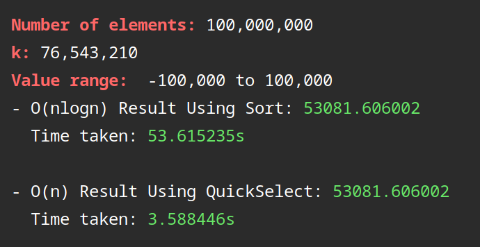

---
title: |
  | \textbf{Project Report}
  | \Large{An Implementation Of:}
subtitle: | 
  | A Simple Randomized $O(n\,log\, n)$–Time Closest-Pair
  | Algorithm in Doubling Metrics
author:
  - Minh Thang Cao
date: "`r format(Sys.time(), '%d %B %Y')`"
lang: "en"
fontsize: 12pt
output:
  pdf_document:
    keep_tex: true
    fig_caption: yes
    latex_engine: pdflatex
    includes:
      in_header: preamble.tex
indent: true
...

# 1 \enspace Introduction {#section1}

Implementation of an algorithm helps us observe its efficiency and behavior in practice. In this report, I will briefly explain each part of the closest-pair doubling algorithm [1], show the program's implementation along with practical running time analysis, and some implementation techniques I used.
The theoretical information in this report fully refers to the work of A. Maheshwari, W. Mulzer and M. Smid, see [1].

Given a metric space $(P,dist)$, with doubling dimension $d$, whose $P$ is a set of $n$ points. The closest pair of points is the two points with the distance $\delta_0$ that satisfies $dist(p_1, p_2) \geq \delta_0$ for any point $p_1, p_2 \in P$. Also, the doubling dimension $d$ of a metric space indicates that for every point $p$ in $P$ and every real number $R > 0$, the $ball_P(p, R)$ can be covered by at most $2^d$ balls in $P$ of radius $R/2$, see [1, Section 2]. By using the definition and properties of the doubling metric space and its doubling dimension, the algorithm will find the closest-pair distance without the direct use of the points' coordinates in $O(n\,log\,n)$ time.

The closest-pair algorithm consists of three smaller parts:

\vspace{-2.5truemm}
>\begin{enumerate}
 \item Computing a separating annulus, denoted \textsc{SepAnn}$(S,n,d,\mu,c)$
 \item The refinement of \textsc{SepAnn}$(S,n,d,\mu,c)$, denoted \textsc{SparseSepAnn}$(S,n,d,t)$
 \item The main recursive closest-pair algorithm, denoted \textsc{ClosestPair}$(S,n,d)$
\end{enumerate}

\vspace{-2truemm}
Throughout the paper, let:

\vspace{-2truemm}
>\begin{itemize}
 \item $(P, dist)$ be a finite metric space in which $P$ is the set of all points, and $dist$ is the function that calculate the distance between any two points
 \item $d$ be the space's doubling dimension
 \item $S$ be a non-empty subset of $P$
\end{itemize}

\vspace{-2truemm}
 \underline{\emph{\textbf{Note}}}: I will only mention 2D points because of the extremely high running time of the algorithm in the space more than 3D (in which the doubling dimension is approximately at least \boldmath$log_221$ that gives us the base case with more than $3\,000\,000$ points).
\unboldmath

\newpage

# 2 \enspace Algorithm 1: Computing a separating annulus {#section2}

An important part of the main closest-pair algorithm is finding a separating annulus in the subset $S$. I will briefly describe this algorithm in the next subsection, due to A. Maheshwari, W. Mulzer and M. Smid [1, Section 3.1].

## 2.1 The $\mathrm{S\pnt{EP}A\pnt{NN}}(S,n,d,\mu,c)$ algorithm {#section2.1}

In this section, $\mu \ge1$ is a real constant number, $c$ is calculated based on $\mu$ (I would say that $c = 2(4\mu)^d$ [1, Remark 1] since $\mu$ is not an integer in this case [1, Section 3.2]).

This algorithm picks a uniformly random point $p$ from the subset $S$ then finds the smallest ball centered at $p$, denoted $ball_S(p, R_p)$, that contains at least $n/c$ point. If the outer ball $ball_S(p,\mu R_p)$ contains at most $n/2$ points, it returns $p$ and $R_p$. If not, this procedure is repeated until the condition is satisfied. This algorithm's pseudocode is given below, see [1, Section 3.1].

\begin{figure}[ht]
  \centering
  \begin{minipage}{0.9\linewidth}
    {\LinesNotNumbered
    \begin{algorithm}[H]
    \SetKwInOut{Input}{Input}
    \Input{Let $S$ be a subset of $P$, of size $n$, $d$ be the metric space's doubling dimension, $\mu \geq 1$ and $c >1$ be large enough real numbers. }

    \SetKwInOut{Output}{Output}
    \Output{A point $p \in S$ and a radius $R_p > 0$.}
    \DontPrintSemicolon
    \SetAlgoLined
    \BlankLine

    \centering
    \begin{minipage}{.80\linewidth}
    \Repeat{$|ball_S(p, \mu R_p)| \leq n/2$}
      {p = a uniformly random point in $S$;

      $R_p$ = min\{$r > 0: |ball_S(p, r)| \geq n/c$\};}
      return $p$ and $R_p$
    \end{minipage}
    \caption{\textsc{SparseSepAnn}$(S,n,d,t)$}
    \end{algorithm}}
  \end{minipage}
  \begin{minipage}{0.90\textwidth}
    \begin{flushright}
    {\footnotesize \emph{This pseudocode is from [1, Section 3.1]}\par}
    \end{flushright}
  \end{minipage}
\end{figure}

## 2.2 \enspace Finding the $K^{th}$ smallest element {#section2.2}

One step in \textsc{SepAnn($S,n,d,\mu,c$)} algorithm is to find the smallest ball which contains at least $n/c$ points. This ball is easy to find using the $k^{th}$ smallest element algorithm. Particularly, in a list of distances between $p$ and all other points in $S$, we pick the $\lceil n/c\rceil$-th smallest element and let it be the radius of the ball we need to find. Thus, all points closer to $p$ are inside this ball.

A very easy approach to find the $k^{th}$ smallest element in a list is to sort it in ascending order, and then simply return the element at the $k^{th}$ place. This sorting algorithm takes $O(n\,log\,n)$ time complexity in the worst case. Fortunately, we can improve the running time to $O(n)$ using a common recursive technique called QuickSelect, which is similar to QuickSort.

Given an unordered list $D$ which contains $n$ numbers, and a positive integer $k$ satisfies $1 \leq k \leq n$. Each element in $D$ has an index from $0$ to $n-1$. Consider a sublist of $D$, denoted $D[a:b]$, which starts from index $a$ and ends at $b$, inclusively. The base case is when $a = b$, the algorithm returns the only element in that sublist. If it is not the case, the algorithm will choose a random *pivot* in the list. The algorithm then rearranges the list so that all elements smaller and larger than the pivot are to the left and right of it, respectively. Now, the pivot has a new index, says $c$. If $k = c-a+1$, the chosen pivot is the $k^{th}$ smallest element of $D$, the algorithm returns $D[c]$. If $k < c-a+1$, the algorithm recurses on the sublist to the left of the pivot, $D[a:c-1]$. If $k > c-a+1$, the algorithm recurses on the sublist to the right of the pivot, $D[c+1:b]$. This algorithm's pseudocode is given below.

\begin{figure}[ht]
  \centering
  \begin{minipage}{.9\linewidth}
    {\LinesNotNumbered
    \SetAlgoRefName{}
    \begin{algorithm}[H]
    \SetKwInOut{Input}{Input}
    \Input{Let $D$ be a list of double numbers, the integers $a$ and $b$ respectively be the starting and ending indices of a sublist and $k$ be an integer refers to the $k^{th}$ smallest element.}
    \SetKwInOut{Output}{Output}
    \Output{The $k^{th}$ smallest element in $D$, a double number.}
    \SetAlgoLined
    \BlankLine
    \centering
    \begin{minipage}{.75\linewidth}
		\uIf{$a == b$} {
			return $D[i]$
		}\Else {
      $p$ = a random element in $D$;
      
      \SetKwBlock{partitioning}{\textnormal{\textbf{rearranging:}}}{end;}

      \partitioning{
      all elements smaller than $p$ to the left of $p$;

      all elements larger than $p$ to the right of $p$;
      }

      
      $c$ = the current index of $p$ in $D$;

      \uIf{$k == c-a+1$} {
        return $p$
      }\uElseIf{$k < c-a+1$} {
        return \textsc{KthSmallest}$(D,a,c-1,k)$
      }\Else{
        return \textsc{KthSmallest}$(D,c+1,b,k)$
      }
    }
    \end{minipage}
    \caption{\textsc{KthSmallest}$(D, a, b, k)$}
    \end{algorithm}}
  \end{minipage}
\end{figure}

Unlike the original QuickSort algorithm, the QuickSelect recurses only once and on one side after rearranging. This helps the algorithm remain $O(n)$ time complexity. By using the random selection, the pivot on average is close to the middle of the list. Therefore, with the input is an $n$-sized list $D$, the recursive call is on a sublist whose size is a half. Because the rearrangement takes $O(n)$ time, this algorithm takes at most $2n$ time which is $O(n)$. The running time is shown below:

$$O(n) + O(n/2) + O(n/4) +... \leq O(2n) = O(n)$$

The following image is one of many outputs using different numbers of elements and $k$ values. I generated $100\,000\,000$ numbers uniformly random in the range [-100000, 100000] with $k$ = 76,543,210.

```{r, echo=FALSE, fig.align="center", out.width="70%", fig.cap="\\label{fig1:figs}The outputs of the $O(NlogN)$ algorithm using regular sorting and the $O(n)$ QuickSelect algorithm that recurses only once."}

```

\hrule
\  

\  

With the given number of elements, $k$ and value range, both of the algorithms produced the same result, which is 53081.606002, but the running times of them have a significant difference (For the program's output, see Figure \ref{fig1:figs}).

Since the QuickSelect takes at most $2n$ running time, the regular sorting takes at least $log(n)/2$ times more than it, and the $log$ is in base 2. In this case, there are $100\,000\,000$ numbers, so:
$$\frac{log(n)}{2} = \frac{log(100\,000\,000)}{2} \approx 13.2877 \text{ times} \leq \frac{53.615235}{3.588446} \approx 14.9411 \text{ times}$$

Since $14.9411$ is quite close to $13.2877$, the running time of this QuickSelect algorithm in practice is reasonable compared to the theory.

# 3 \enspace Algorithm 2: The refinement of $\mathrm{S\pnt{EP}A\pnt{NN}}(S,n,d,\mu,c)$ {#section3}

With the use of the algorithm \textsc{SepAnn$(S,n,d,\mu,c)$}'s output, this refinement algorithm continues to find an annulus that separates the points in $S$ into different smaller sets of points. 

Let $\mu = e$ and $c = 2(4e)^d$, see [1, Remark 1]. The algorithm \textsc{SepAnn$(S,n,d,e,c)$} returns an annulus's center $p \in S$ and its radius, $R'>0$. An input of this refined algorithm is $t > 0$, a large enough constant calculated based on $n$. Let $R_i = (1+1/t)^i\cdot R'$, in which $i$ is a uniformly random element inclusively from $1$ to $t$. The algorithm then finds an annulus centered at $p$ with the inner radius $R_{i-1}$ and outer radius $R_{i}$, denoted $A_i = annulus_S(p, R_{i-1}, R_i)$. If the annulus contains at most $n/t$ points then we are done. The algorithm returns $p$ and $R_{i-1}$. This algorithm has the expected $O(cn)$ time complexity, see [1, Section 3.2].
Otherwise, the previous procedure is repeated until the condition is satisfied. The pseudocode of this refined algorithm is given below.

\begin{figure}[ht] \centering
  \begin{minipage}{1\linewidth}
    {\LinesNotNumbered
    \begin{algorithm}[H]
    \SetKwInOut{Input}{Input}
    \Input{Let $S$ be a subset of $P$, of size $n \geq 2(4e)^d +1$, $d$ be the space's doubling dimension, $t \geq1$ be an integer.}
    \SetAlgoLined
    \SetKwInOut{Output}{Output}
    \Output{A point $p \in S$ and a radius $R > 0$.}
    \BlankLine

    \centering
    \begin{minipage}{.80\linewidth}
    $c = 2(4e)^d$;

    let $p\in S$ and $R' > 0$ be the output of algorithm \textsc{SepAnn$(S,n,d,e,c)$};

    \Repeat{$s \leq n/t$}
      {$i$ = a uniformly random element in $\{1, 2,\ldots, t\};$

      $R_i = (1+1/t)^i\cdot R'$;

      $R_{i-1} = (1+1/t)^{i-1}\cdot R'$;

      $A_i = annulus_S(p,R_{i-1},R_i)$;

      $s = |A_i|$;
      }
      $R = R_{i-1}$;

      return $p$ and $R$
    \end{minipage}
    \caption{\textsc{SparseSepAnn}$(S,n,d,t)$}
    \end{algorithm}}
  \end{minipage}
  \begin{minipage}{1\textwidth}
    \begin{flushright}
    {\footnotesize \emph{This pseudocode is from [1, Section 3.2]}\par}
    \end{flushright}
  \end{minipage}
\end{figure}

# 4 \enspace Algorithm 3: The main closest-pair algorithm {#section4}

  Using the result of \textsc{SparseSepAnn$(S,n,d,t)$}, this main algorithm \textsc{ClosestPair($S,n,d$)} recursively compute the closest distance.

  Let $S$ be an $n$-sized subset of $P$, $d$ be the metric space $(P, dist)$'s doubling dimension.
  In the base case, that is when $n < 2(16e)^d$, the algorithm uses brute-force to compute the closest distance.
  If this is not the case, the algorithm sets $t = \lfloor \frac{1}{16e}(n/2)^{1/d}\rfloor$.
  This algorithm then runs \textsc{SparseSepAnn($S,n,d,t$)} with this $t$ value, and gets the output $p \in S$ and $R>0$ which is the inner radius of the sparse annulus. 
  The outer radius of it is $(1+1/t)R$.

Let $S_1$ be the set of points contained in $ball_S(p, R)$, $S_2$ be the set of points contained in $annulus_S(p, R, (1+1/t)R$ and $S_3$ be the set that contains all the points outside of the outer radius $(1+1/t)R$. This algorithm now recursively calls itself on two subsets of $S$ which are points contained in $ball_S(p,(1+1/t)R)$ (which is $S1 \cup S2$) and outside of $ball_S(p, R)$ (which is $S2 \cup S3$). Finally, the smaller distance output from two recursive calls, $\delta_0 = min(\delta_1, \delta_2)$, is returned. Below is the algorithm's pseudocode, see [1, Section 4.1].

  \begin{figure}[ht]
    \centering
    \begin{minipage}{1\linewidth}
      {\LinesNotNumbered
      \begin{algorithm}[H]
      \SetKwInOut{Input}{Input}
      \Input{Let $S$ be a subset of $P$, of size $n \geq 2$, $d$ be the space's doubling dimension.}
      \SetAlgoLined
      \SetKwInOut{Output}{Output}
      \Output{A real number $\delta_0$ satisfies the two properties in [1, Lemma 5].}
      \BlankLine

      \centering
      \begin{minipage}{.86\linewidth}
      \uIf{$n < 2(16e)^d$} {
        $\delta_0$ = the closest-pair distance in $S$ using brute-force;
      }\Else {
        $t = \lfloor \frac{1}{16e}(n/2)^{1/d}\rfloor$;
        
        let $p \in S$ and $R > 0$ be the output of algorithm \textsc{SparseSepAnn($S,n,d,t$)};
        
        $S_1 = ball_S(p,R)$;

        $S_2 = annulus_S(p,R, (1+1/t)R)$;

        $S_3 = S\, \textbackslash\, (S_1 \cup S_2)$;

        $n' = |S_1 \cup S2|$;
        
        $n'' = |S_2 \cup S3|$;

        $\delta'$ = \textsc{ClosestPair($S_1 \cup S_2, n', d$)};

        $\delta''$ = \textsc{ClosestPair($S_2 \cup S_3, n'', d)$};

        $\delta_0 = min(\delta', \delta'')$;
      }
      return $\delta_0$ 
      \end{minipage}
      \caption{\textsc{ClosestPair}$(S,n,d)$}
      \end{algorithm}}
    \end{minipage}
    \begin{minipage}{1\textwidth}
      \begin{flushright}
      {\footnotesize \emph{This pseudocode is from [1, Section 4.1]}\par}
      \end{flushright}
    \end{minipage}

\end{figure}

# 5 \enspace The Implementation {#section5}

This implementation of the closest-pair doubling algorithm is written in C++ since it is a very common and fast programming language with high-level supports of object-oriented programming that can help us organize the program efficiently (see the implementation's [_GitHub repository_](https://github.com/ThangMinhCao/closestpairdoubling)^[GitHub repository of the implementation. [_https://github.com/ThangMinhCao/closestpairdoubling_](https://github.com/ThangMinhCao/closestpairdoubling)] for the source code). The implementation and its components will be described and explain throughout this section. Also, the code and description of each function will be given below.

To begin with, a set of points, which does not necessarily refer to \code{set} in Computer Science, is always one of the input parameters of each partial algorithm. In this implementation, I would choose \code{vector}, a very popular built-in data structure of C++. Since its size can automatically change when we add or remove an element, it is easy to work with and manage its behavior when implementing. Not only for storing points, \code{vector} will be used throughout the implementation to store some other information.

## 5.1 Utility functions and classes {#section5.1}

### 5.1.1 Random number generator classes {#section5.1.1}

Due to A. Maheshwari, W. Mulzer and M. Smid, the closest-pair doubling algorithm uses randomized technique in some parts to find the targets in linear time. Therefore, generating random numbers is important. I created two random number generator classes, one for integer and one for double, to make the program more simple. The generators' code is given below.

\  
\begin{lstlisting}
#include <random>

class RandomInt{
  public:
      RandomInt(int start, int end) 
          : generator{std::random_device{}()}, int_dist(start, end) {}
      int next() { return int_dist(generator); } 

  private:
      std::mt19937 generator;
      std::uniform_int_distribution<> int_dist;
};

class RandomDouble{
  public:
      RandomDouble(int start, int end) 
          : generator{std::random_device{}()}, double_dist(start, end) {}
      double next() { return double_dist(generator); } 

  private:
      std::mt19937 generator;
      std::uniform_real_distribution<> double_dist;
};
\end{lstlisting}
\vspace{-2truemm}
\begin{minipage}{1\textwidth}
  \begin{flushright}
  {\footnotesize \emph{Source \footnotemark: master branch $\rightarrow$ closestpairdoubling/include/RandomGenerator.h }\par}
  \end{flushright}
\end{minipage}
\vspace{0.5truemm}
\footnotetext{Path to the source file in the implementation's GitHub repository.}

\  
For each class, I create a uniform distribution with a given range that corresponds to the number type and an \code{mt19937} random generator with a \code{random\_device} input. These two variables will be initialized when a random generator object is instantiated. Each class also has a \code{next()} function that can be called to return a random number.

### 5.1.2 \emph{Point} and \emph{PointList} classes {#section5.1.2}

Since points are fundamental elements of the algorithm, and they are not just numbers (they have their own coordinates), creating a \code{Point} class is quite essential. Moreover, with the addition of the class function \code{distance\_to}, the algorithm can calculate the distance between any two points easily without directly using the points' coordinates. This function works as the input function $dist$ that is provided with the metric space ($P, dist$). The implementation code of the class is given below.

\  
\begin{lstlisting}
#include <vector>
#include <cmath>

class Point {
  private:
    std::vector<double> coordinate;

  public:
    explicit Point(std::vector<double> coordinate) {
      this->coordinate = std::move(coordinate);
    }
    Point()= default;
    // distance is calculated using Pythagorean Theorem
    double distance_to(const Point& another_point) {
      double total_square = 0;
      for (int i = 0; i < coordinate.size(); i++) {
        double iDiff = coordinate[i] - another_point.getCoordinate()[i];
        total_square += (iDiff) * (iDiff);
      }
      return sqrt(total_square);
    }
    std::vector<double> getCoordinate() const {
      return coordinate;
    }
}
\end{lstlisting}
\vspace{-2truemm}
\begin{minipage}{1\textwidth}
  \begin{flushright}
  {\footnotesize \emph{Source: master branch $\rightarrow$ closestpairdoubling/include/Point.h}\par}
  \end{flushright}
\end{minipage}
\vspace{0.5truemm}

\  
Because there is not only one method to generate points (see the description later in [Section 6](#section6)), so if all of them are implemented in the \code{main()}, the function will be quite huge and complicated. Thus, I created another utility class to make the code more organized, \code{PointList}. The \code{PointList} class consists of a \code{vector} named $points$ that store all the points in a subset of $P$ and some point generating functions. This class is used as subsets of $P$ and to initialize all the points in $P$ at the start of the program.

\  
\begin{lstlisting}
#include "Point.h"
#include "RandomGenerator.h"

class PointList {
  public:
    std::vector<Point> points;

    // initializes all points uniformly random, see Section 6 for more details 
    void random_initializer(int dimension, int point_num,
                            int coor_start_range, int coor_end_range)
    {
      RandomDouble random_double(coor_start_range, coor_end_range);
      for (int i = 0; i < point_num; i++) {
        std::vector<double> coor;
        // number of coordinates is the dimension value
        for (int j = 0; j < dimension; j++) {
          coor.push_back(random_double.next());
        }
        points.push_back(Point(coor));
      }
    }

    // initializes points in grid, see Section 6 for more details 
    void grid_initializer(double dist, int xFactor, int yFactor, int position)
    {
      // the grid starts at coordinates (position, position)
      int y = 0;
      while (y < yFactor) {
        int x = 0;
        while (x < xFactor) {
          std::vector<double> coor;
          coor.push_back(position + (x++) * dist);
          coor.push_back(position + y * dist);
          points.push_back(Point(coor));
        }
        y++;
      }
    }
}
\end{lstlisting}
\vspace{-2truemm}
\begin{minipage}{1\textwidth}
  \begin{flushright}
  {\footnotesize \emph{Source: master branch $\rightarrow$ closestpairdoubling/include/PointList.h}\par}
  \end{flushright}
\end{minipage}

### 5.1.3 $K^{th}$ smallest element finder {#section5.1.3}

The $K^{th}$ smallest algorithm has its own class. In this class, I define a shorter type name \code{DVect} which is \code{std::vector<double>}. The QuickSelect algorithm is divided into three functions, the main is \code{get}, and two assistances \code{swap} and \code{partition}. The function \code{get} returns the $k^{th}$ smallest element using QuickSelect, and the other using the normal sort. Although I only use the QuickSelect technique, I create both to compare their time complexity, see [Section 2.2](#section2.2).


\  
\begin{lstlisting}
#include <vector>

typedef std::vector<double> DVect;

class KthSmallest {
  private:
    static void swap (double *a, double *b);
    static int partition(DVect& distances, int start, int end);

  public:
    // get k-th smallest element with QuickSelect
    static double get(DVect& distances, int start, int end, int k);
    // get k-th smallest element with normal sorting 
    static double get_with_sorting(DVect distances, int k);
};
\end{lstlisting}
\vspace{-2truemm}
\begin{minipage}{1\textwidth}
  \begin{flushright}
  {\footnotesize \emph{Source: master branch $\rightarrow$ closestpairdoubling/include/KthSmallest.h}\par}
  \end{flushright}
\end{minipage}
\vspace{0.5truemm}

\  
Due to its simplicity and irrelevant uses (only for testing and analyzing), the implementation of the normal sorting technique will not be listed in this report, see the \emph{GitHub repository} for the code. The following is the implementation code of the QuickSelect algorithm.

\newpage

\begin{lstlisting}
#include "KthSmallest.h"
#include "RandomGenerator.h"

void KthSmallest::swap (double *a, double *b) {
  double temp = *a;
  *a = *b;
  *b = temp;
}

int KthSmallest::partition(DVect& distances, int start, int end) {
  double pivot = distances[end];
  int slow = start;
  int fast = start;
  // moving the smaller elements to the left and larger elements to the right
  while (fast < end) {
    if (distances[slow] > pivot) {
      while (fast < end and distances[fast] > pivot) {
        fast++;
      }
      if (distances[fast] < pivot) {
        swap(&distances[slow], &distances[fast]);
      } else {
        break;
      }
    }
    fast++;
    slow++;
  }
 	// swapping the pivot from end back to its original place
  swap(&distances[slow], &distances[end]);
  return slow;
}

double KthSmallest::get(DVect& distances, int start, int end, int k) {
  if (start == end) {return distances[start];}
  //  swapping the random pivot to the end
  RandomInt random_int_gen = RandomInt(start, end);
  swap(&distances[random_int_gen.next()], &distances[end]);
  int cur_pivot = partition(distances, start, end);
  if (k == cur_pivot - start + 1) {
    return distances[cur_pivot];
  } else if (k < cur_pivot - start + 1) {
    return get(distances, start, cur_pivot - 1, k);
  } else {
    return get(distances, cur_pivot + 1, end, k - cur_pivot + start - 1);
  }
}

\end{lstlisting}
\vspace{-2truemm}
\begin{minipage}{1\textwidth}
  \begin{flushright}
  {\footnotesize \emph{Source: master branch $\rightarrow$ closestpairdoubling/src/KthSmallest.cpp}\par}
  \end{flushright}
\end{minipage}
\vspace{0.5truemm}

The function \code{swap(double *a, double *b)} swaps two elements in a vector by swaps the values at the addresses that the pointers \code{*a} and \code{*b} point to. Thus, their values in a vector are swapped while their identities are still the same.

The function \code{partition(DVect\& distances, int start, int end)} takes the last element in \code{distances} to be the pivot. Then, it rearranges the vector so that every element smaller and larger than pivot is to the left and right of it. The technique I use in this function is creating two pointers \code{fast} and \code{slow}. Both pointers move towards the end step by step together until \code{distances[slow]} > \code{pivot}, then it stops. The \code{fast} keep moving until \code{distances[fast]} < \code{pivot}, then the value at two indices are swapped. This procedure is repeated until the \code{fast} reach the end of the vector The \code{pivot} is now swapped back to the \code{slow} position, where it is supposed to be.

A generic call is \code{get(DVect\& distances, int start, int end, int k)}. It first checks if the sub-vector has only one element (as well as \code{start == end}) then returns it. Otherwise, it selects a random pivot in the vector then swaps it with the last element. Now, the \code{partition} function is called to return the index of the pivot after rearranging. The base case is when there are exactly $k$ elements from index 0 to the current pivot in the original vector (which is \code{cur\_pivot - start + 1}), so it is the $k^{th}$ smallest element. If there are more than $k$ elements, the function is recursively called on the sub-vector to the left of the pivot. If there are less than $k$ elements, the function is called on the sub-vector to the right, but now the $k$ should be decreased by \code{cur\_pivot - start + 1}. Due to [Section 2.2](#section2.2), this procedure takes $O(n)$ time complexity.

## 5.2 The closest-pair doubling algorithm {#section5.2}

The implementation of the closest-pair algorithm still consists of three main functions, \code{sep\_ann}, \code{sparse\_sep\_ann} and \code{closest\_pair}. Moreover, the \code{brute\_force} function is added to be used in the base case. The following is the algorithm's class.

\  
\begin{lstlisting}
#include "PointList.h"

typedef std::vector<double> DVect;

class ClosestPairDoubling {
  private:
    static std::tuple<Point, double, DVect> sep_ann(PointList &S, int n, double mu, double c);
    static std::pair<Point, double> sparse_sep_ann(PointList &S, int n, double d, int t);
  public:
    ClosestPairDoubling() = default;
    static double brute_force(PointList &S);
    static double closest_pair(PointList &S, double d, int recursion=0);
};
\end{lstlisting}
\vspace{-2truemm}
\begin{minipage}{1\textwidth}
  \begin{flushright}
  {\footnotesize \emph{Source: master branch $\rightarrow$ closestpairdoubling/include/ClosestPairDoubling.h}\par}
  \end{flushright}
\end{minipage}

### 5.2.1 The $\mathrm{S\pnt{EP}A\pnt{NN}}(S,n,d,\mu,c)$ algorithm {#section5.2.1}

The \code{sep\_ann} function starts by defining some important variables to be used in its loop. Let \code{p} be the chosen random point in $S$, \code{Rp} be the radius of the smallest ball containing at least $n/c$ points, \code{distances\_from\_p} be the vector stores the distances between $p$ and all points in $S$ and \code{outer\_ball\_count} be the number of points in the outer ball, $ball_S(p,\mu R_p)$. To select a random point $p$, I initialize an integer random generator \code{int\_gen} with the range from 0 to $n - 1$, possible indices of points in $S$.

Since $c$ is calculated based on $d$ which could be done outside the function, I removed the input $d$ of the \code{sep\_ann} function.

\  
\begin{lstlisting}
std::tuple<Point, double, DVect>
      ClosestPairDoubling::sep_ann(PointList &S, int n, double mu, double c)
{
  Point p;
  double Rp = -1.0;
  DVect distances_from_p;
  int outer_ball_count = (n / 2) + 1;
  RandomInt int_gen(0, n - 1);

  while (Rp == -1.0 or outer_ball_count > std::floor(n / 2)) {
    distances_from_p.clear();

    // selecting the random point p and calculate all the distances
    int random_index = int_gen.next();
    p = S.points[random_index];
    for (const Point& point: S.points) {
      distances_from_p.push_back(p.distance_to(point));
    }
    Rp = KthSmallest::get(distances_from_p, 0, (int)distances_from_p.size(), ceil(n / c));

    // counting the number of point in the outer ball
    outer_ball_count = 0;
    for (double dist: distances_from_p) {
      if (dist <= mu * Rp) {
        outer_ball_count++;
      }
    }
  }
  return std::make_tuple(p, Rp, distances_from_p);
}
\end{lstlisting}
\vspace{-2truemm}
\begin{minipage}{1\textwidth}
  \begin{flushright}
  {\footnotesize \emph{Source: master branch $\rightarrow$ closestpairdoubling/src/ClosestPairDoubling.cpp}\par}
  \end{flushright}
\end{minipage}
\vspace{0.5truemm}

Each time the $while$ loop is repeated, \code{distances\_from\_p} is cleared to get rid of the previous loop's result.
The function uses \code{int\_gen} to generate a random point in $S$, then it stores distances between $p$ and every point in $S$ including itself into \code{distances\_from\_p}.
The QuickSelect function from \code{KthSmallest} class is now used to get the $ceil(n/c)$-smallest element in \code{distances\_from\_p}, then it is assigned to \code{Rp}.
The function loops through the distance vector to count the number of points inside the outer ball and assigns it to \code{outer\_ball\_count}.
If \code{outer\_ball\_count} < $\lfloor n/2 \rfloor$ then we are done, the function returns a tuple containing \code{p}, \code{Rp} and \code{distances\_from\_p}.
If this is not the case, the procedure is repeated until the condition is satisfied. Note that, I return \code{distances\_from\_p} here to use it in \textsc{SparseSepAnn} without spending time to loop through the vector again.

### 5.2.2 The refined algorithm $\mathrm{S\pnt{PARSE}S\pnt{EP}A\pnt{NN}}(S,n,d,t)$ {#section5.2.2}

Let \code{sep\_ann\_res} be the output of the function \code{sep\_ann(S, n, e, c)}, \code{Ai\_size} be the number of points $annulus_S(p, R_{i-1}, R_i)$ contains. Let \code{p}, \code{R\_prime} and \code{distance\_from\_p} be the variables store the values which are derived from \code{sep\_ann\_res}. The implementation code of \textsc{SparseSepAnn} is given below.

\  
\begin{lstlisting}
std::pair<Point, double>
  ClosestPairDoubling::sparse_sep_ann(PointList &S, int n, double d, int t)
{
  const double e = std::exp(1.0); // the Euler constant
  double c = 2 * pow(4 * e, d);
  std::tuple<Point, double, DVect> sep_ann_res = sep_ann(S, n, e, c);

  // followings are results derived from sep_ann_res
  Point p = std::get<0>(sep_ann_res);
  double R_prime = std::get<1>(sep_ann_res);
  DVect distances_from_p = std::get<2>(sep_ann_res);

  int Ai_size = n / t + 1;
  RandomInt range_t_random(1, t);

  double R;
  while (Ai_size > n / t) {
    int random_i = range_t_random.next();
    double Ri = pow(1 + 1.0 / t, random_i) * R_prime;
    R = pow(1 + 1.0 / t, random_i - 1) * R_prime;
    Ai_size = 0;
    for (double dist: distances_from_p) {
      if (R <= dist and dist <= Ri) {
        Ai_size++;
      }
    }
  }
  return std::pair<Point, double> {p, R};
}
\end{lstlisting}
\vspace{-2truemm}
\begin{minipage}{1\textwidth}
  \begin{flushright}
  {\footnotesize \emph{Source: master branch $\rightarrow$ closestpairdoubling/src/ClosestPairDoubling.cpp}\par}
  \end{flushright}
\end{minipage}
\vspace{0.5truemm}

\

The algorithm first selects a random value $i$ in the range from 1 to $t$ using the random generator \code{range\_t\_random}, then it calculates the inner and outer radius of $annulus_S(p, R_{i-1}, R_i)$ in which $R_i = (1+1/t)^i$. An inner \code{for} loop goes through \code{distance\_from\_p} to count the number of points in the annulus and then stores the number to \code{Ai\_size}. If \code{Ai\_size} > $n/t$, the right annulus is found, then it returns \code{p} and \code{R}. Otherwise, the \code{while} loop repeats the procedure to find the annulus that satisfies \code{Ai\_size} $\leq n/t$.

### 5.2.3 The main closest-pair algorithm $\mathrm{C\pnt{LOSEST}P\pnt{AIR}}(S,n,d)$ {#section5.2.3}

Let \code{n} be the number of points contained in $S$, \code{e} be the Euler constant, \code{delta0} be the closest-pair distance in $S$. Furthermore, I combine the three subsets $S_1$, $S_2$ and $S_3$ (see [Section 4](#section4)) to only two that are \code{S1orS2} and \code{S2orS3} that represent the subset $S_1 \cup S_2$ and $S_2 \cup S_3$.

\  
\begin{lstlisting}
double
	ClosestPairDoubling::closest_pair(PointList &S, double d, int recursion)
{
  int n = (int)S.points.size();
  const double e = std::exp(1.0);
  double delta0; // the closest-pair distance in S

  if (n < 2 * pow(16 * e, d)) {
    return brute_force(S);
  } else {
    int t = floor((1 / (16 * std::exp(1.0))) * pow((double)n / 2, 1 / d));
    std::pair<Point, double> ssann_result = sparse_sep_ann(S, n, d, t);
    Point p = ssann_result.first;
    double R = ssann_result.second;

    PointList S1orS2 = PointList();
    PointList S2orS3 = PointList();
    for (const Point& point: S.points) {
      double d_to_p = p.distance_to(point);
      if (d_to_p <= R) {
        S1orS2.points.push_back(point);
      } else if (d_to_p > R and d_to_p <= (1 + 1.0/t) * R) {
        S1orS2.points.push_back(point);
        S2orS3.points.push_back(point);
      } else {
        S2orS3.points.push_back(point);
      }
    }
    std::vector<Point>().swap(S.points); // free the memory that stores S
    double delta1 = closest_pair(S1orS2, d, ++recursion);
    double delta2 = closest_pair(S2orS3, d, ++recursion);
    delta0 = std::min(delta1, delta2);
  }
  return delta0;
}
\end{lstlisting}
\vspace{-2truemm}
\begin{minipage}{1\textwidth}
  \begin{flushright}
  {\footnotesize \emph{Source: master branch $\rightarrow$ closestpairdoubling/src/ClosestPairDoubling.cpp}\par}
  \end{flushright}
\end{minipage}
\vspace{0.5truemm}

With $t = \lfloor \frac{1}{16e}(n/2)^{1/d}\rfloor$, \code{sparse\_sep\_ann(S,b,d,t)} is called, and the outputs of it are assigned into \code{p} and \code{R}. The \code{for} loop goes through $S$ to build the two sets by adding corresponding points to them using the distance from $p$ to each point. Let \code{d\_to\_p} be the distance from $p$ to the current point in the \code{for} loop. If \code{d\_to\_p} $\leq$ $R$, the current point is in the $ball_S(p, R)$, so it is added to \code{S1orS2}. If $R <$ \code{d\_to\_p} $\leq (1 + 1/t)R$, the point is in the $annulus_S(p, R, (1+1/t)R)$, then it is added to both \code{S1orS2} and \code{S2orS3}. Otherwise, the point is appended into only \code{S2orS3} since it is outside the outer radius.

Because every point in $S$ is now in \code{S1orS2} and \code{S2orS3}, it is not necessary to keep the vector \code{S} as well as its memory usage, which could be stacked up after many recursive calls and cause memory overload. Thus, after storing all the points into \code{S1orS2} and \code{S2orS3}, I clear the vector \code{S} and its data in the memory using the function \code{vector::swap()} to swap \code{S} with an empty vector.
Note that, I will make sure to pass the full set of points **by value** or pass a copy of it to the first call of the algorithm, so the original one will not be changed. Therefore, it can not affect the execution of \code{brute\_force} for testing later.

After that, the outputs of two recursive calls, one on \code{S1orS2} and one on \code{S2orS3}, will be stored in \code{delta1} and \code{delta2} variables. Finally, the smaller one of them will be assigned into \code{delta0} and returned.

# 6 \enspace The algorithm's running time in practice {#section6}

After doing many tests, I found out that the algorithm's behavior will be different based on the way the points are arranged on the metric space. There are two approaches to generate the points that give me the most obvious differences.

  1. **Generating uniformly random** points spread throughout the space. To do this, we can just use any of the random number generators to get the points' random coordinates in a given range, see [Section 5.1.1](#section5.1.1) and [Section 5.1.2](#section5.1.2) for more details. 

  2. **Generating points evenly in a grid**. Let $n$ be the number of points, $a$ and $b$ be any two factors of $n$ that satisfies $a\times b = n$, $d$ be the distances between any two points which are close together. Start at any position, the points are set into the $a \times b$ grid which means each point is on a corner of a $d$-sided square, see Figure \ref{fig:grid}.

\begin{figure}[!h]
\centering
\begin{tikzpicture}
  \foreach \x in {0, 1, 2, 3, 4, 5, 6} {
    \foreach \y in {0, 1, 2, 3, 4} {
      \node (thisNode) at (1.5*\x, 1.5*\y) {};
      \ifthenelse{\x=6}{}{\draw[dashed,gray,thick] (1.5*\x, 1.5*\y) -- (1.5*\x+1.5, 1.5*\y);}
      \ifthenelse{\y=4}{}{\draw[dashed,gray,thick] (1.5*\x, 1.5*\y) -- (1.5*\x, 1.5*\y+1.5);}
      \node at (thisNode) [circle,fill=black,inner sep=2pt] {};
    }
  }
  \draw[black,very thick,latex-latex] (0, 1.5*4) -- node[above] {$d$} (1.5, 1.5*4);
  \draw[black,very thick,latex-latex] (0, 1.5*4) -- node[left] {$d$} (0, 1.5*3);
\end{tikzpicture}

\caption{An example of generating points in a grid. A set of 35 points that gives us a $5\times7$ grid. Points are placed at corners of the squares whose sides are equal to $d$ that could be any number.}
\label{fig:grid}
\end{figure}

\hrule
\  

\

## 6.1 The 2D algorithm for testing 

In the project, I also implement the 2D closest-pair algorithm using Divide-and-conquer algorithm due to Bentley and Shamos, see [5]. This algorithm is very helpful in testing and debugging the closest-pair doubling algorithm because of its short running time. I will briefly describe the algorithm below.

Given a set of point $P$, the base case is when $P$ contains less than 2 points. If there is only one, the algorithm returns positive $\infty$. If there are two points, the algorithm basically returns the distance between them. Otherwise, $P$ is sorted in ascending order based on the points' $x$-coordinate. Then, it chooses a vertical line, $\ell$, that divides the set $P$ into two halves, $P_1$ contains $\lfloor n/2 \rfloor$ points and $P_2$ contains $\lceil n/2 \rceil$ points. The algorithm now recursively calls itself on $P_1$ and $P_2$, so the minimum of the two outputs would be the temporary closest-pair distance, $\delta_0 = min(\delta_1, \delta_2)$. It is obvious that there could be a pair of points (one from $P_1$ and the other from $P_2$) which has a closer distance than the temporary $\delta_0$, and we have not calculated yet.

To combine the two set $P_1$ and $P_2$, we create a strip centered at $\ell$ with its left end and right end are the lines $\ell_1$ and $\ell_2$ so that both lines are $\delta_0$ away from $\ell$. All the points in the strip are now sorted based on their $y$-coordinate. The algorithm then can loop through the strip and check if there is any smaller distance than $\delta_0$. Fortunately, for each point in the strip, the algorithm just needs to check the distances between the current point with its 7 successive points, that have $y$-coordinates $\geq$ the current point's $y$-coordinate. If there is any closer distance, it is assigned to $\delta_0$. Finally, $\delta_0$ is returned.

To keep the report on point and less complicated, the code of this 2D algorithm will not be listed. See the implementation on my [_GitHub repository_](https://github.com/ThangMinhCao/closestpairdoubling/tree/master/utils)^[The implementation of the 2D algorithm with merge sort algorithm. [_https://github.com/ThangMinh-_ _Cao/closestpairdoubling/tree/master/utils_](https://github.com/ThangMinhCao/closestpairdoubling/tree/master/utils)].

## 6.2 The practical running time

To have the running time that is close to the theory, the number of points in $P$ must be extremely large since the base case of the algorithm is when $n < 2(16e)^d$, which is already a quite large number (approximately $79\,550$ points in 2D and more than $3\,000\,000$ points in 3D, for example). To correctly compare the algorithm's running time, we can use brute-force which takes $O(n)$ time or the 2D algorithm for only 2D points. 

## 6.3 Probability to select a "good" point of $\mathrm{S\pnt{EP}A\pnt{NN}}(S,n,d,\mu,c)$ {#section6.2}

Again, the goal of algorithm \textsc{SepAnn($S,n,d,\mu,c$)} is to find a "good" point $p$ in $S$. A "good" point $p$ implies that with $R_p$ (the radius of the smallest $ball_S(p,R_p)$ that contains at least $n/c$ points), the $ball_S(p,\mu R_p)$ contains at most $n/2$ points. Due to A. Maheshwari, W. Mulzer and M. Smid [1, Lemma 3], the algorithm has probability at least $1/c$ (about $1/1623.4$ in 2D space) to select a good point uniformly random from $S$.
Like the practical running time, the number of times the algorithm \textsc{SepAnn($S,n,d,\mu,c$)} repeats until it gets a good point also depends on the way how the input points are generated.

 Generating point randomly produces a surprising behavior of this algorithm.
Every time \textsc{SepAnn($S,n,d,\mu,c$)} is called, it only repeats _once_ until it gets to the base case, that means the probability to get a good point is 100%, see algorithm's data on
[_GitHub repository_](https://github.com/ThangMinhCao/closestpairdoubling/blob/master/report/Images/closest_pair/random_generation/random_sep_ann_data.txt)^[Random points SepAnn data.
[_https://github.com/ThangMinhCao/closestpairdoubling/blob/master/rep- ort/images_%_26_data/closest_pair/random_generation/random_sep_ann_data.txt_](https://github.com/ThangMinhCao/closestpairdoubling/blob/master/report/images_%26_data/closest_pair/random_generation/random_sep_ann_data.txt)].
Since the points are generated randomly, so they change every time, there are no explanations about specific properties of the points in this case. However, since $100\%$ satisfied the probability at least $1/c$, this result is reasonable.

On the other hand, when using the grid way to generate points, the algorithm \textsc{SepAnn($S,n,d,\mu,c$)} now repeats multiple times which is its expected behavior, see an example output in Figure \ref{fig:data}. Again, the lowest probability in most of the trials in this case is about $1/20$ which satisfies probability at least $1/c$. For the full grid input data, see the [_GitHub repository_](https://github.com/ThangMinhCao/closestpairdoubling/blob/master/report/images_%26_data/closest_pair/grid_generation/grid_sepann_data.txt)^[Grid points SepAnn data. [_https://github.com/ThangMinhCao/closestpairdoubling/blob/master/report/-_ _images_%_26_data/closest_pair/grid_generation/grid_sepann_data.txt_](https://github.com/ThangMinhCao/closestpairdoubling/blob/master/report/images_%26_data/closest_pair/grid_generation/grid_sepann_data.txt)].


\begin{figure}
\begin{minipage}{0.48\textwidth}
  \centering
  \begin{tabular}{|c|c|}
  \hline
  $\pmb n$   & \textbf{Repeat times} \\ \hline
   200000  & 6            \\ \hline
   193836  & 7            \\ \hline
   179534  & 2            \\ \hline
   172501  & 1            \\ \hline
   158381  & 13           \\ \hline
   156531  & 3            \\ \hline
  \ldots   & \ldots       \\ \hline
  \end{tabular}
\end{minipage}
\begin{minipage}{0.48\textwidth}
  \centering
  \begin{tabular}{|c|c|}
  \hline
  $\pmb n$   & \textbf{Repeat times} \\ \hline
  \ldots   & \ldots       \\ \hline
  101943   & 4            \\ \hline
   96367   & 2            \\ \hline
   96154   & 2            \\ \hline
   83621   & 6            \\ \hline
   83288   & 13           \\ \hline
   82515   & 2            \\ \hline
  \end{tabular}
\end{minipage}
\caption[Caption]{Given an input of $200\,000$ points generated in a grid. This is a portion of the data about the number of times the algorithm \textsc{SepAnn$(S,n,d,\mu,c)$} repeats.}
\label{fig:data}

\end{figure}

\hrule

# 7 \enspace Conclusion {#section6}


\medskip

\begin{thebibliography}{9}
\bibitem{latexcompanion} 
A. Maheshwari, W. Mulzer and M. Smid. \emph{A Simple Randomized $O(n\,log\,n)$–Time Closest-Pair Algorithm in Doubling Metrics}, 2020. \url{https://arxiv.org/abs/2004.05883}

\bibitem{latexcompanion} 
J. L. Bentley and M. I. Shamos. Divide-and-conquer in multidimensional space. In \emph{Proceedings of the 8th ACM Symposium on the Theory of Computing}, pages 220–230,
1976.

\end{thebibliography}
